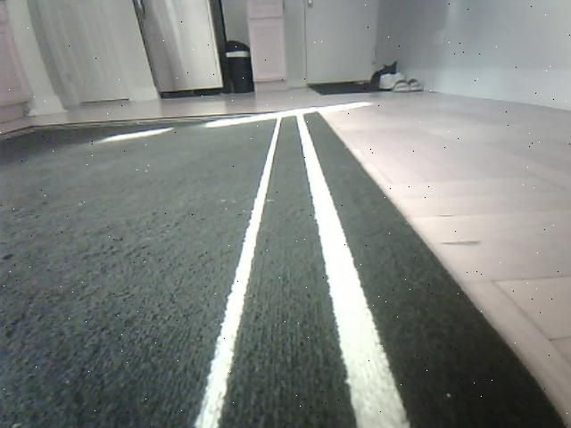
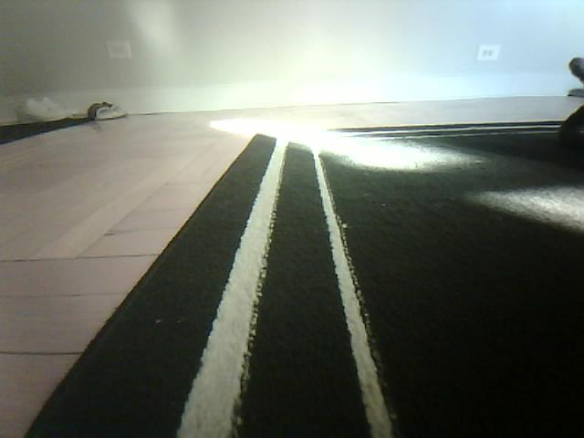
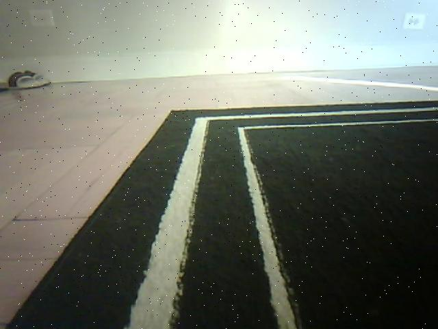
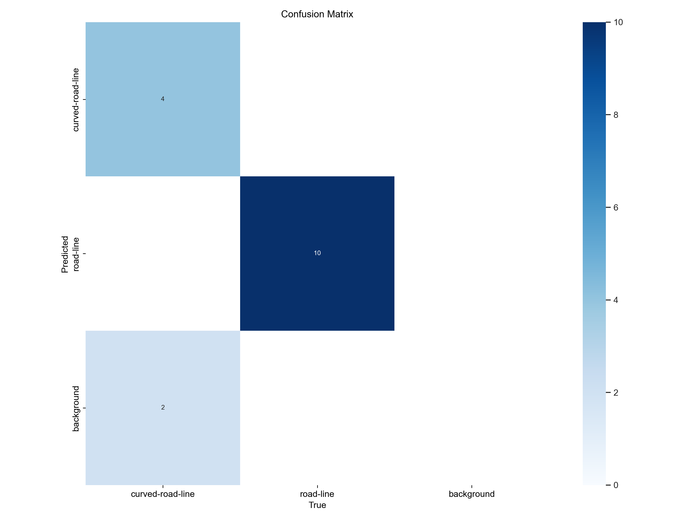
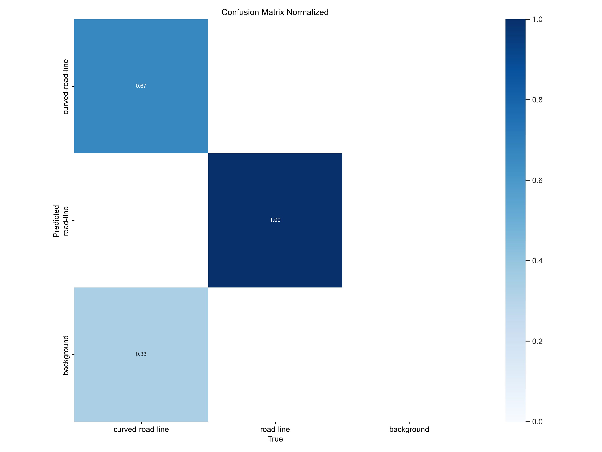
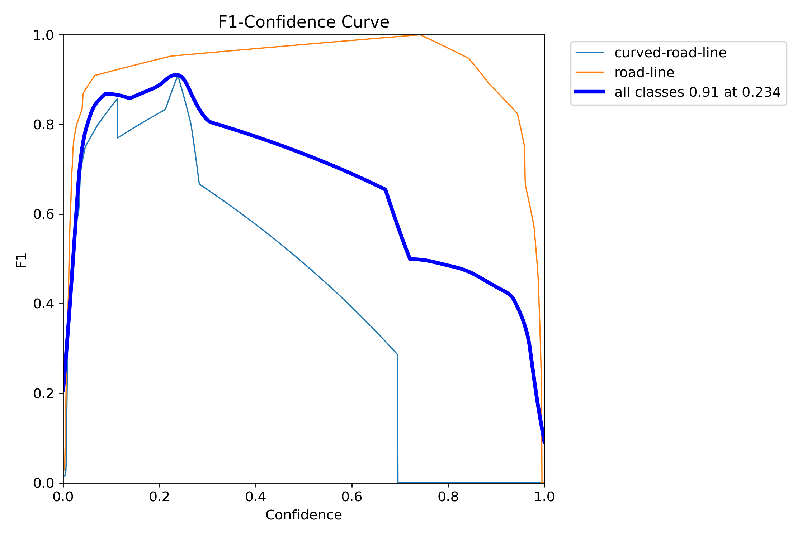
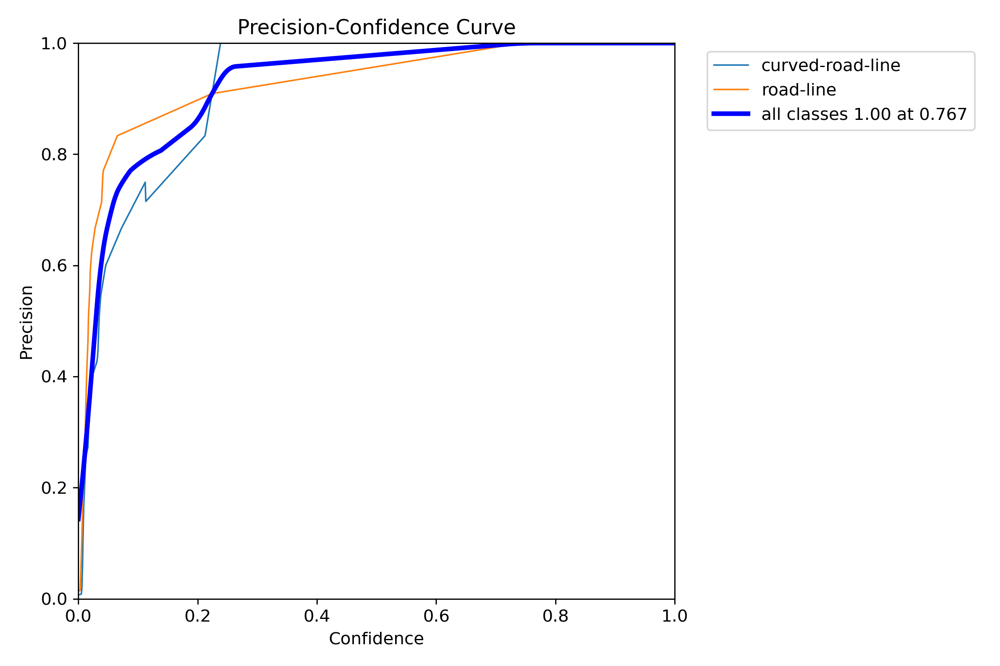
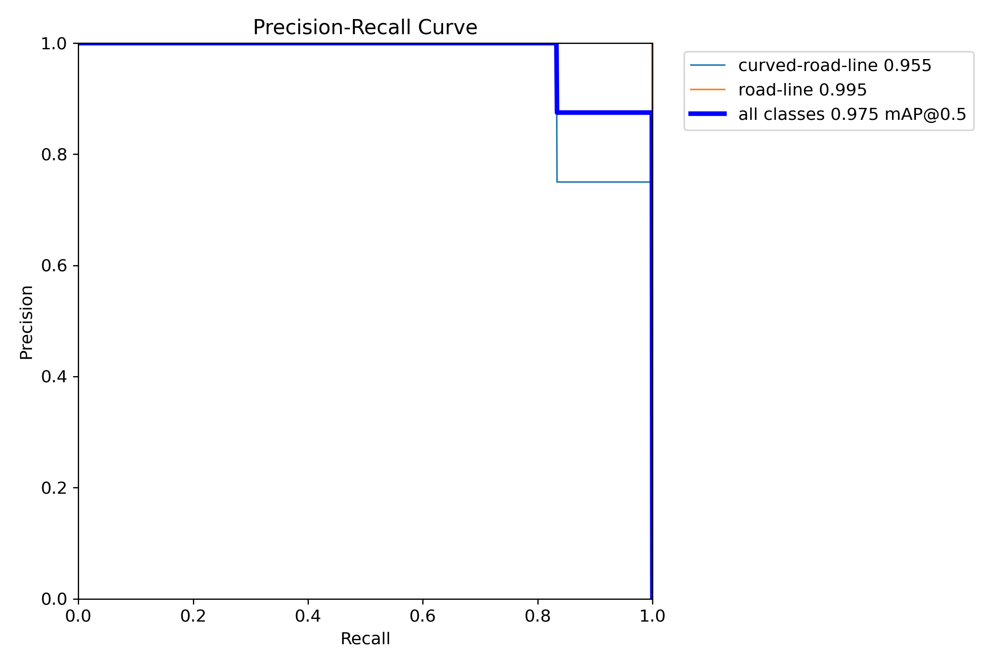
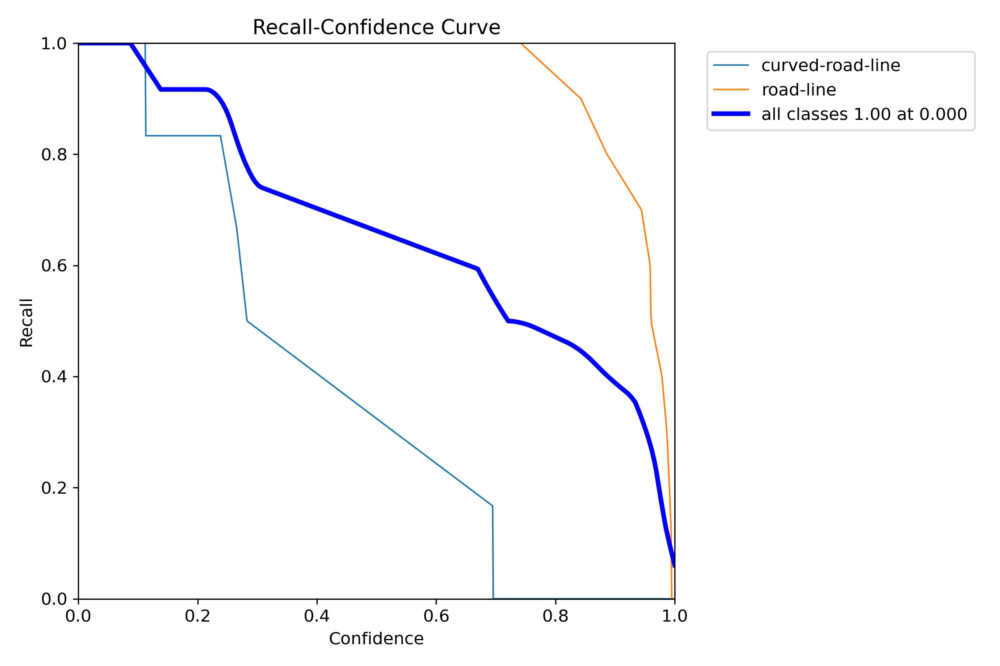
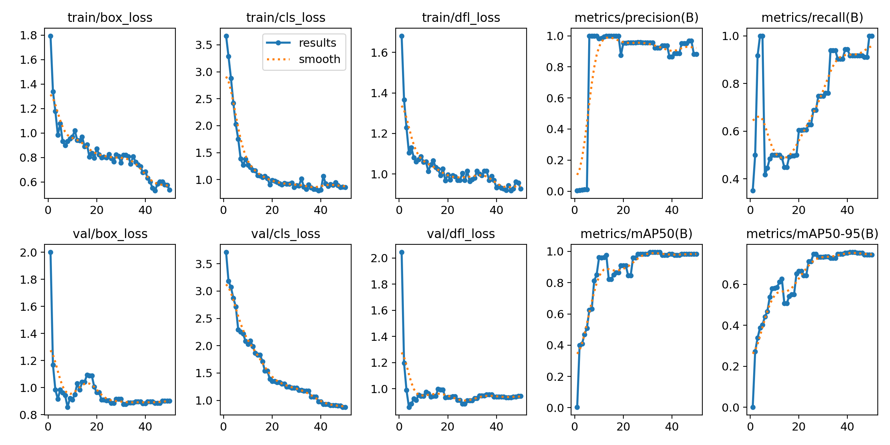

# Road Line Detection Results

This repository demonstrates the performance and evaluation metrics of a trained road line detection model in YOLOv8. Below are the results including confusion matrices, evaluation curves, and loss metrics during training.

***Note: 'curved-road-line' detection was not implemented in the final implementation due to the poor depth of the ESP32***

---

## Dataset Examples

### Trained Road Line Samples
| **Image 1**            | **Image 2**            | **Image 3**            |
|-------------------------|------------------------|------------------------|
|    |    |    |

---

### Mask Samples (From Taped Lines)
| **Image 1**            | **Image 2**            | **Image 3**            |
|-------------------------|------------------------|------------------------|
|    |    |    |

---

### Lane Detection ROI

---

## Evaluation Results

### Confusion Matrices
1. **Standard Confusion Matrix**  
   

2. **Normalized Confusion Matrix**  
   

---

### Performance Curves

1. **F1-Confidence Curve**  
   

2. **Precision-Confidence Curve**  
   

3. **Precision-Recall Curve**  
   

4. **Recall-Confidence Curve**  
   

---

### Training and Validation Metrics

**Training Losses and Validation Metrics**  

- **Box Loss** and **Classification Loss** for both training and validation.
- **Precision** and **Recall** metrics over epochs.
- mAP@50 and mAP@50-95 scores during training.
